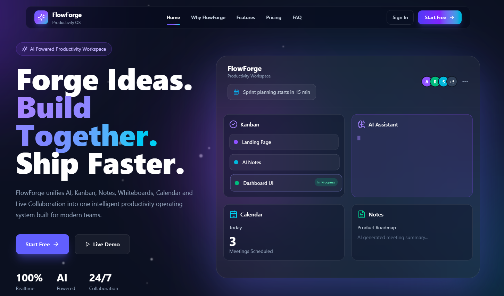
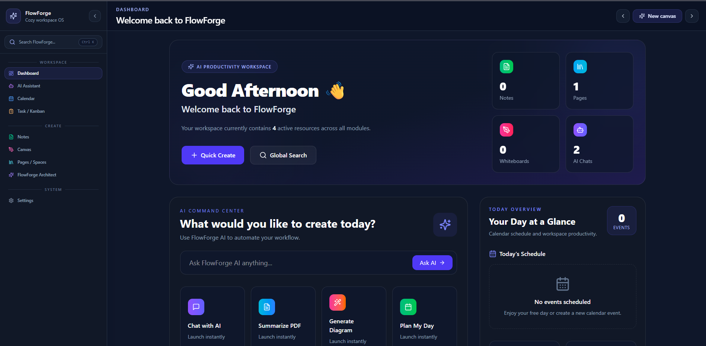
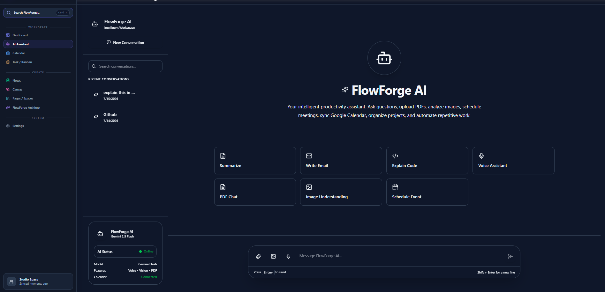
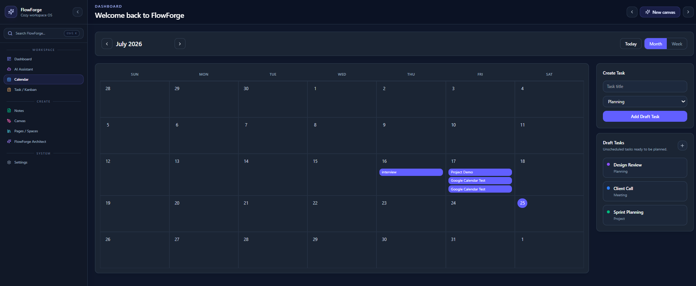
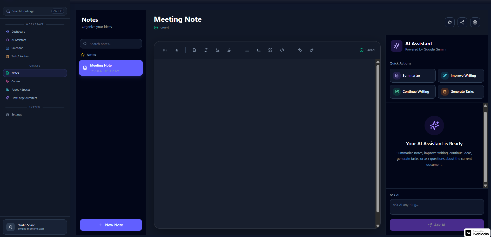
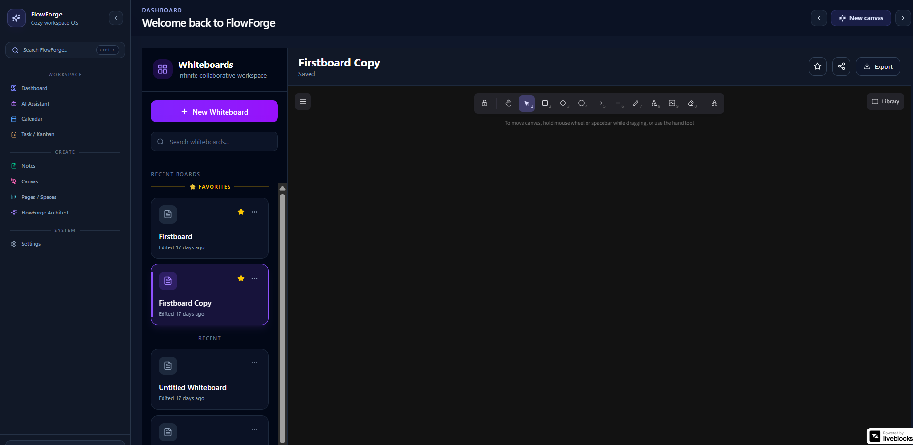
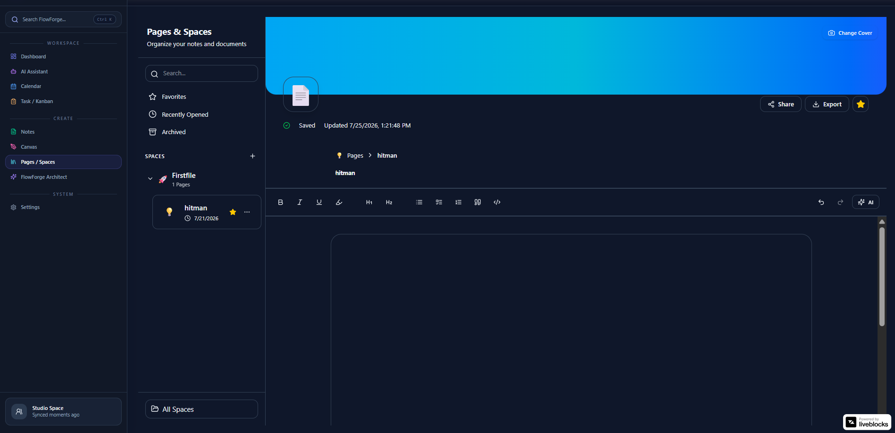
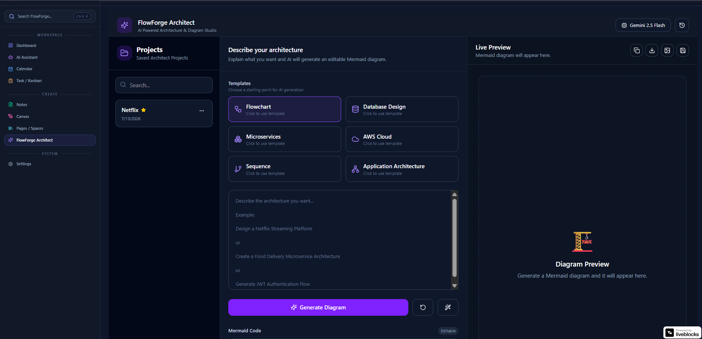
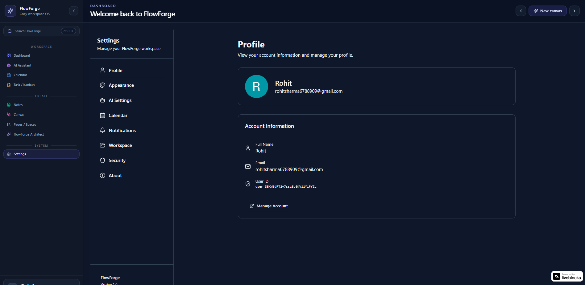

<div align="center">

# 🚀 FlowForge

### AI-Powered Productivity Workspace for Modern Teams

FlowForge is an all-in-one productivity platform that combines AI assistance, collaborative whiteboards, smart notes, knowledge management, workflow architecture, and calendar planning into a single modern workspace.

Designed with a clean, responsive interface and powered by AI, FlowForge helps users organize ideas, collaborate efficiently, and automate everyday workflows.

<br/>

[](https://nextjs.org/)
[](https://react.dev/)
[](https://www.typescriptlang.org/)
[](https://mongodb.com/)
[](https://tailwindcss.com/)
[](https://ai.google.dev/)
[](https://clerk.com/)
[](https://vercel.com/)

</div>

---

# 🌐 Live Demo

### 🔗 Production

> https://flowforge-tech.vercel.app

---

# 📖 Table of Contents

- Introduction
- Features
- Screenshots
- Technology Stack
- System Architecture
- Folder Structure
- Installation
- Environment Variables
- Feature Walkthrough
- AI Features
- Google Calendar Integration
- Database Design
- Authentication Flow
- Deployment
- Future Enhancements
- License

---

# 📌 Introduction

FlowForge is an AI-powered productivity workspace inspired by platforms like **Notion**, **Miro**, and **ChatGPT**.

Instead of switching between multiple applications for note-taking, brainstorming, scheduling, document management, and AI assistance, FlowForge provides a unified workspace where everything works together.

The application focuses on improving productivity by combining intelligent automation with an intuitive and modern user experience.

Whether you're managing projects, organizing personal knowledge, collaborating with teammates, or interacting with AI, FlowForge brings everything into one platform.

---

# ✨ Core Features

## 🤖 AI Assistant

- AI-powered conversations
- PDF document analysis
- Image understanding
- Voice-enabled interaction
- Context-aware responses using Gemini AI
- Fast response generation

---

## 📅 Smart Calendar

- Personal event management
- Google Calendar synchronization
- Create, edit and delete events
- Upcoming event reminders
- Daily planning dashboard

---

## 📝 Notes

- Rich text editor
- Quick note creation
- Search functionality
- Organized workspace
- Persistent storage using MongoDB

---

## 🎨 Whiteboard

- Infinite collaborative canvas
- Drawing and brainstorming
- Excalidraw integration
- Auto-saving boards
- Create multiple whiteboards

---

## 📚 Pages & Spaces

- Knowledge management
- Rich document editing
- Nested pages
- Workspace organization
- Markdown-like editing experience

---

## ⚡ FlowForge Architect

Visual workflow builder designed to help users create and organize AI workflows.

Features include:

- Node-based workflow creation
- Drag-and-drop interface
- AI automation planning
- Visual workflow organization

---

## 🔒 Authentication

Powered by Clerk.

Features include:

- Email Authentication
- Google Login
- Secure Session Management
- Protected Routes
- User Profiles

---

## 📊 Dashboard

Modern dashboard providing quick access to every module.

Includes:

- Workspace Overview
- Quick Launch
- Recent Activity
- Statistics
- Productivity Widgets

---

## 🎯 Search

Global search across the workspace allowing users to quickly access pages, notes, whiteboards, and more.

---

# ⭐ Highlights

- Responsive Design
- Modern UI
- Dark Theme
- Smooth Animations
- AI Powered
- Mobile Friendly
- Secure Authentication
- Cloud Hosted

# 🖼️ Screenshots

> **Note:** Create a `screenshots/` folder in the project root and add the following images. Replace the placeholders below with your own screenshots.

---

## 🌐 Landing Page

The modern landing page introduces FlowForge with a clean UI, feature highlights, pricing, FAQ, and call-to-action sections.



---

## 📊 Dashboard

The central productivity hub providing quick access to all workspace modules.



---

## 🤖 AI Assistant

Powered by Google Gemini AI for conversations, document understanding, image analysis, and intelligent assistance.



---

## 📅 Calendar

Manage events, schedules, and synchronize tasks with Google Calendar.



---

## 📝 Notes

Rich note-taking workspace with persistent storage and search capabilities.



---

## 🎨 Whiteboard

Infinite collaborative whiteboard powered by Excalidraw for brainstorming and planning.



---

## 📚 Pages & Spaces

Organize documents, knowledge, and project documentation with a structured editor.



---

## ⚡ FlowForge Architect

Visual workflow builder for designing AI-powered automation flows.



---

## ⚙️ Settings

Manage profile, preferences, integrations, and workspace configuration.



---

# 🏗️ System Architecture

```text
                         ┌───────────────────────────┐
                         │        User Browser       │
                         └─────────────┬─────────────┘
                                       │
                              HTTPS Requests
                                       │
                                       ▼
                    ┌──────────────────────────────────┐
                    │      Next.js Frontend (App)      │
                    │                                  │
                    │  • Dashboard                     │
                    │  • AI Assistant                  │
                    │  • Notes                         │
                    │  • Whiteboard                    │
                    │  • Calendar                      │
                    │  • Architect                     │
                    │  • Pages                         │
                    └─────────────┬────────────────────┘
                                  │
                  ┌───────────────┼─────────────────┐
                  │               │                 │
                  ▼               ▼                 ▼
          Clerk Authentication  Gemini AI      Google Calendar
                  │               │                 │
                  └───────────────┼─────────────────┘
                                  │
                                  ▼
                           Next.js API Routes
                                  │
                                  ▼
                             MongoDB Database
```

---

# 🛠️ Technology Stack

## Frontend

| Technology | Purpose |
|------------|----------|
| Next.js 16 | Full-stack React Framework |
| React 19 | UI Development |
| TypeScript | Type Safety |
| Tailwind CSS v4 | Styling |
| Framer Motion | Animations |
| shadcn/ui | UI Components |
| Lucide React | Icons |

---

## Backend

| Technology | Purpose |
|------------|----------|
| Next.js API Routes | Backend APIs |
| MongoDB | Primary Database |
| Mongoose | ODM |
| React Query | Data Fetching |
| Zustand | State Management |

---

## AI

| Technology | Purpose |
|------------|----------|
| Google Gemini AI | AI Conversations |
| PDF Processing | Document Understanding |
| Image Analysis | Visual AI |
| Voice Support | AI Voice Interaction |

---

## Authentication

| Technology | Purpose |
|------------|----------|
| Clerk | Authentication |
| JWT Sessions | User Security |
| OAuth | Google Login |

---

## Whiteboard

| Technology | Purpose |
|------------|----------|
| Excalidraw | Infinite Canvas |
| Live State | Real-time Board State |
| MongoDB | Board Persistence |

---

## Deployment

| Technology | Purpose |
|------------|----------|
| Vercel | Hosting |
| GitHub | Version Control |
| Environment Variables | Secret Management |

---

# 📂 Project Structure

```text
FlowForge/
│
├── app/
│   ├── (dashboard)/
│   ├── assistant/
│   ├── architect/
│   ├── calendar/
│   ├── notes/
│   ├── pages/
│   ├── settings/
│   ├── whiteboard/
│   ├── api/
│   ├── sign-in/
│   └── sign-up/
│
├── components/
│   ├── assistant/
│   ├── architect/
│   ├── calendar/
│   ├── dashboard/
│   ├── landing/
│   ├── notes/
│   ├── pages/
│   ├── ui/
│   └── whiteboard/
│
├── hooks/
│
├── lib/
│
├── models/
│
├── providers/
│
├── public/
│
├── screenshots/
│
├── styles/
│
├── middleware.ts
│
├── package.json
│
└── README.md
```

---

# 🗄️ Database Overview

FlowForge uses **MongoDB** as the primary database for storing workspace data.

Collections include:

- Users
- Notes
- Pages
- Whiteboards
- Calendar Events
- AI Conversations
- Architect Projects
- Settings

All workspace data is securely associated with authenticated users through Clerk.

---

# 🔄 Application Workflow

```text
User Login
      │
      ▼
Clerk Authentication
      │
      ▼
Dashboard
      │
      ├──────────────► AI Assistant
      │
      ├──────────────► Calendar
      │
      ├──────────────► Notes
      │
      ├──────────────► Whiteboard
      │
      ├──────────────► Pages
      │
      └──────────────► Architect
                      │
                      ▼
                 MongoDB Storage
```

---

# 🎨 Design Philosophy

FlowForge follows a modern productivity-first design inspired by leading workspace applications.

Key principles include:

- Minimal and distraction-free interface
- Dark theme optimized for extended use
- Smooth micro-interactions
- Responsive layouts across devices
- Consistent visual hierarchy
- Fast navigation between modules
- Accessibility-focused component design
- Scalable architecture for future enhancements

---

# ⚙️ Installation

Follow these steps to set up FlowForge on your local machine.

## 1. Clone the Repository

```bash
git clone https://github.com/YOUR_USERNAME/FlowForge.git

cd FlowForge
```

---

## 2. Install Dependencies

```bash
npm install
```

---

## 3. Configure Environment Variables

Create a `.env.local` file in the project root and add the following variables.

```env
# Clerk Authentication
NEXT_PUBLIC_CLERK_PUBLISHABLE_KEY=

CLERK_SECRET_KEY=

# MongoDB
MONGODB_URI=

# Gemini AI
GEMINI_API_KEY=

# Google OAuth
GOOGLE_CLIENT_ID=

GOOGLE_CLIENT_SECRET=

GOOGLE_REDIRECT_URI=http://localhost:3000/api/google/callback

# Application URL
NEXT_PUBLIC_APP_URL=http://localhost:3000
```

---

## 4. Start Development Server

```bash
npm run dev
```

Visit

```
http://localhost:3000
```

---

# 🚀 Deployment

FlowForge is deployed using **Vercel**.

Deployment process:

1. Push code to GitHub
2. Import repository into Vercel
3. Configure environment variables
4. Deploy
5. Update Clerk production domain
6. Configure Google OAuth redirect URIs
7. Redeploy to apply production settings

Live Application:

> https://flowforge-tech.vercel.app

---

# 🔐 Authentication Flow

FlowForge uses **Clerk Authentication** for secure user management.

Authentication Features:

- Email & Password Login
- Google OAuth Login
- Protected Dashboard Routes
- Secure Session Handling
- User Profile Management

Workflow:

```text
User
 │
 ▼
Sign In / Sign Up
 │
 ▼
Clerk Authentication
 │
 ▼
Session Created
 │
 ▼
Protected Dashboard
 │
 ▼
Application Features
```

---

# 🤖 AI Assistant

FlowForge integrates **Google Gemini AI** to provide intelligent productivity assistance.

Capabilities include:

- Natural language conversations
- PDF document understanding
- Image analysis
- Context-aware responses
- Productivity guidance
- Fast AI-generated answers

Workflow:

```text
User Prompt
      │
      ▼
Next.js API Route
      │
      ▼
Gemini AI API
      │
      ▼
Generated Response
      │
      ▼
Displayed in Chat Interface
```

---

# 📅 Google Calendar Integration

The Calendar module allows users to manage their schedules while synchronizing with Google Calendar.

Features:

- Create Events
- Edit Events
- Delete Events
- Google Calendar Sync
- Upcoming Event Display

Workflow:

```text
Create Event
      │
      ▼
MongoDB Storage
      │
      ▼
Google Calendar API
      │
      ▼
Google Calendar Updated
```

---

# 🎨 Whiteboard Module

The Whiteboard module provides an infinite collaborative workspace powered by Excalidraw.

Features:

- Infinite canvas
- Drawing tools
- Shapes
- Freehand sketching
- Auto-save
- Multiple boards
- Persistent storage in MongoDB

---

# 📚 Pages & Spaces

Designed as a structured knowledge management system.

Features:

- Rich text editing
- Organized workspace
- Persistent storage
- Document hierarchy
- Productivity-focused interface

---

# 📝 Notes

A lightweight module for quickly capturing ideas.

Supports:

- Create Notes
- Edit Notes
- Delete Notes
- Search Notes
- Persistent Storage

---

# ⚡ FlowForge Architect

FlowForge Architect enables users to visually design AI-powered workflows.

Current Features:

- Workflow Dashboard
- Project Management
- Visual Cards
- Workspace Organization

Future Scope:

- Drag-and-drop nodes
- AI workflow execution
- Automation engine
- Third-party integrations

---

# 📡 API Overview

FlowForge exposes API routes for application functionality.

Major API categories include:

### Authentication

```
/api/auth
```

### AI Assistant

```
/api/assistant
```

### Calendar

```
/api/calendar
```

### Notes

```
/api/notes
```

### Pages

```
/api/pages
```

### Whiteboard

```
/api/whiteboards
```

### Architect

```
/api/architect
```

---

# 🛡️ Security

Security practices implemented:

- Clerk Authentication
- Protected API Routes
- Secure Environment Variables
- MongoDB Access Control
- OAuth Authentication
- HTTPS Deployment
- Server-side Validation

---

# 📱 Responsive Design

FlowForge is optimized for:

- Desktop
- Laptop
- Tablet
- Mobile Devices

Responsive layouts are built using Tailwind CSS.

---

# 📈 Future Enhancements

Upcoming ideas for FlowForge include:

- Real-time collaboration
- Team workspaces
- AI meeting summaries
- AI-generated diagrams
- Workflow templates
- File uploads
- Notifications
- Dark/Light theme switcher
- Kanban implementation
- Analytics dashboard
- Workspace sharing
- Role-based permissions
- Export to PDF
- Offline support
- Mobile application

---

# 💡 Challenges Solved

During development, several engineering challenges were addressed:

- Implementing Clerk Authentication with protected routes
- Integrating Google Gemini AI for multiple input types
- Building a scalable App Router architecture
- Managing application state efficiently
- Persisting workspace data using MongoDB
- Synchronizing Google Calendar events
- Integrating Excalidraw into Next.js
- Designing a modular and reusable component architecture
- Deploying and configuring a production-ready application on Vercel

---

# 👨‍💻 Developer

**Atharva Phanse**

Software Developer

Passionate about building AI-powered web applications and modern full-stack solutions.

### Connect with me

- GitHub: https://github.com/Atharva45264
- LinkedIn: https://www.linkedin.com/in/atharvaphanse-tech/

---

# 📄 License

This project is licensed under the MIT License.

Feel free to use this project for learning and inspiration.

---

# ⭐ Support

If you found this project useful:

⭐ Star the repository

🍴 Fork the project

🐞 Report issues

💡 Suggest new features

---

<div align="center">

## 🚀 Built with ❤️ using Next.js, TypeScript, MongoDB, Gemini AI & Clerk 

### If you like this project, don't forget to ⭐ the repository!

</div>
- Production Ready

---
